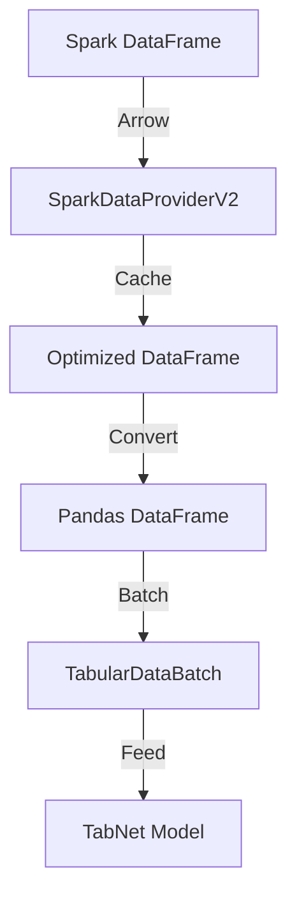

# TabNet Spark Integration Architecture

This document explains the architectural decisions and design rationale behind the TabNet Spark integration.

## Design Goals

1. **Memory Efficiency**
   - Handle large datasets that don't fit in memory
   - Minimize memory overhead during processing
   - Efficient data transfer between Spark and PyTorch

2. **Performance**
   - Optimize data loading and conversion
   - Leverage Arrow for efficient data transfer
   - Enable parallel processing where possible

3. **Usability**
   - Simple, intuitive API
   - Consistent with TabNet's existing interfaces
   - Proper error handling and feedback

## Architecture Decisions

### 1. Data Provider Pattern

**Decision**: Implement Spark integration using the TabularDataProvider interface.

**Rationale**:
- Consistent with TabNet's existing data loading patterns
- Clear separation of concerns
- Enables future extensions for other data sources

**Trade-offs**:
- Some Spark-specific optimizations might be limited
- Need to maintain compatibility with interface

### 2. Arrow Integration

**Decision**: Use Arrow for data transfer between Spark and pandas.

**Rationale**:
- Significantly better performance than native conversion
- Memory-efficient serialization
- Built-in support in modern Spark versions

**Trade-offs**:
- Requires Arrow to be enabled in Spark
- Some overhead for very small datasets

### 3. Batch Processing

**Decision**: Process data in configurable batches with prefetching.

**Rationale**:
- Controls memory usage
- Enables streaming-like processing
- Allows for parallel processing

**Trade-offs**:
- Additional complexity in implementation
- Need to tune batch sizes

### 4. Memory Management

**Decision**: Convert entire DataFrame to pandas during initialization.

**Rationale**:
- Simpler implementation
- Better performance for typical dataset sizes
- More predictable memory usage

**Trade-offs**:
- Higher initial memory usage
- Not suitable for extremely large datasets

### 5. Error Handling

**Decision**: Comprehensive input validation and error handling.

**Rationale**:
- Catch issues early
- Provide clear error messages
- Prevent silent failures

**Trade-offs**:
- Some performance overhead
- More complex implementation

## Component Interactions

## Performance Considerations

### 1. Data Loading

- Use Arrow for efficient data transfer
- Cache optimized DataFrame
- Proper partition sizing

### 2. Memory Usage

- Batch processing to control memory
- Pre-allocate arrays where possible
- Clear references to free memory

### 3. Computation

- Leverage Spark's parallel processing
- Optimize tensor conversion
- Minimize data copying

## Error Handling Strategy

### 1. Input Validation

- Validate DataFrame schema
- Check column existence and types
- Validate configuration parameters

### 2. Runtime Errors

- Handle Spark execution errors
- Manage memory-related issues
- Provide clear error messages

### 3. Recovery

- Clean up resources on failure
- Provide debugging information
- Enable retry mechanisms

## Testing Strategy

### 1. Unit Tests

- Test individual components
- Validate error handling
- Check edge cases

### 2. Integration Tests

- End-to-end workflows
- Performance benchmarks
- Memory usage tests

### 3. Performance Tests

- Measure data loading speed
- Monitor memory usage
- Compare with baseline

## Future Considerations

### 1. Scalability

- Support for larger datasets
- Distributed processing
- Better memory management

### 2. Features

- Complex data type support
- Custom preprocessing
- Enhanced monitoring

### 3. Integration

- Better Spark ML Pipeline integration
- Support for other data sources
- Enhanced monitoring capabilities

## Monitoring and Debugging

### 1. Metrics

- Data loading time
- Memory usage
- Batch processing speed

### 2. Logging

- Operation progress
- Performance metrics
- Error details

### 3. Debugging

- Clear error messages
- Stack traces
- Performance profiling

## Conclusion

The architecture balances performance, memory efficiency, and usability. The design decisions prioritize reliability and maintainability while providing room for future optimizations and features.